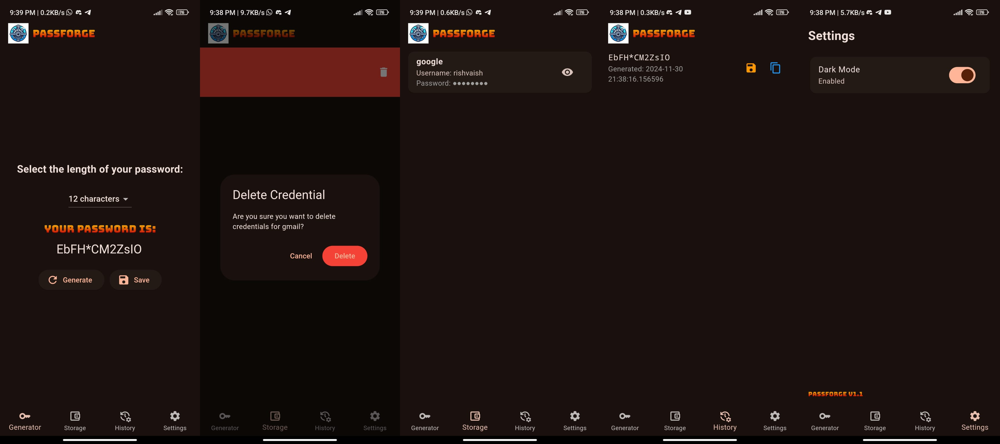

# PassForge

## Table of Contents

1. [Overview](#overview)
2. [Features](#features)
3. [Screenshots](#screenshots)
4. [Security Features](#securityfeatures)
5. [Installation](#installation)
    - [Prerequisites](#prerequisites)
    - [Steps](#steps)
6. [ProjectStructure](#projectstructure)
7. [License](#license)

## Overview <a name="overview"></a>

PassForge is a Flutter-based mobile application designed to help users generate, store, and manage secure passwords with robust authentication and user-friendly features.

## Features <a name="features"></a>

- Secure Credential Manager: A dedicated module for securely managing credentials (secure_credential_manager.dart).
- Dynamic Frontend Integration: Using main.dart as the primary entry point for the application, with seamless interaction between UI and backend logic.
- Custom Styling and Fonts: Enhanced user experience with customizable fonts like Comic Sans and Bungee_Spice.

## Screenshots <a name="screenshots"></a>
 
 ### In Light Theme
 []

 ### In Dark Theme
 []

## Security Features <a name="securityfeatures"></a>

- Local authentication using device biometrics
- Secure credential management
- Temporary password history with auto-expiration
- Theme-based UI with material design

## Installation <a name="installation"></a>
### Prerequisites <a name="prerequisites"></a>

- Flutter SDK
- Dart
- Compatible mobile development environment (Android Studio/Xcode/VSCode)

### Steps <a name="steps"></a>

- Clone the Repository:
```bash
git clone https://github.com/your-username/your-repo.git
```
- Navigate to the Project Directory:
```bash
cd your-repo
```
- Install Dependencies: Ensure you have Flutter installed. Run:
```bash
flutter pub get
```
- Run the Application:
```bash
flutter run
```

## Project Structure <a name="projectstructure"></a>

- main.dart: Entry point of the application. Manages the primary UI and routes.
- secure_credential_manager.dart: Contains logic for handling secure credentials, adhering to best practices in security like using(I wont say the encryption).

## License <a name="license"></a>

This project is licensed under the Apache-2.0 License. See the [LICENSE](LICENSE) file for details.